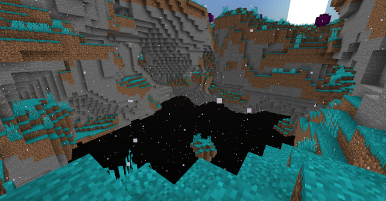

## The Mushroom Higlands

A Minecraft Datapack that adds a new dimension to the game: The Mushroom Highlands. It's inspired by the famous Minecraft mod The Aether, and a other datapack made by VelVoxel Raptor, called the Dream Dimension.

The Datapack add's a whole new dimension, wich features new items, mobs, biomes and structures.

#### Coming Soon:
- New structures (in progress, it's currently implemented, but I can't get them to actually spawn in-game, help is appreciated)
- New mobs
- New items (almost done)

### How to use:
- Install the datapack
- Enable the datapack
- Get a elytra
- Fly up to 270
- You will now see the floating islands of the Mushroom Highlands appear
- To get back, jump over the edge of a island into the void
- You will fall into the overworld

THIS PACK USES EXPERIMENTAL FEATURES, wich only work in Minecraft 1.16.2 and above. These features can change at ANY time. They can also cause your game to chrash, or even worse, your world to corrupt. PLEASE BE AWARE of this when using this pack, and ALWAYS back-up your worlds before using it.

